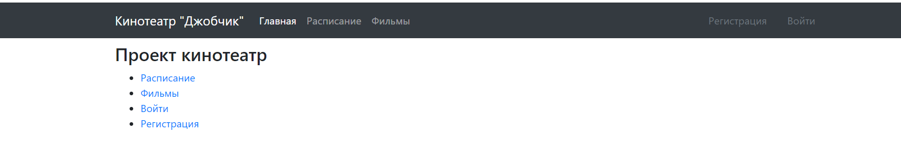
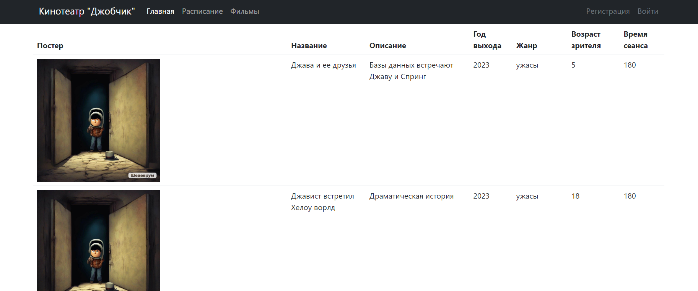
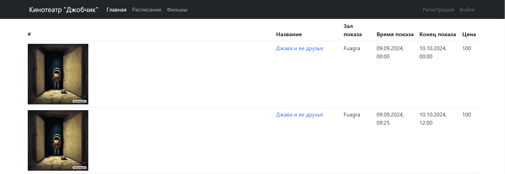
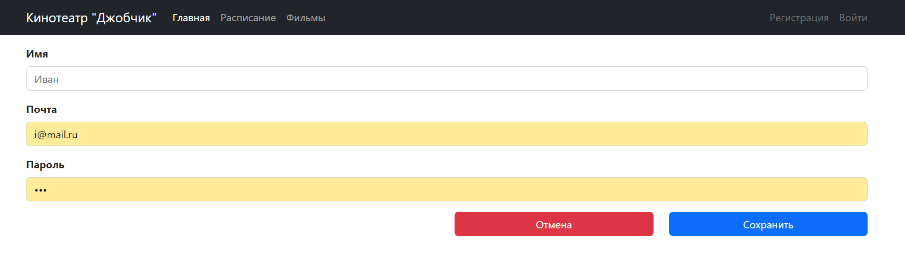
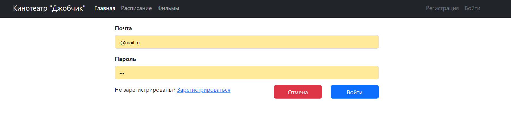
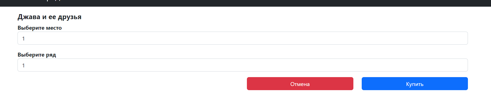
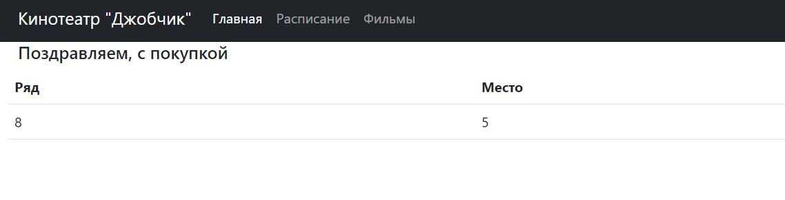
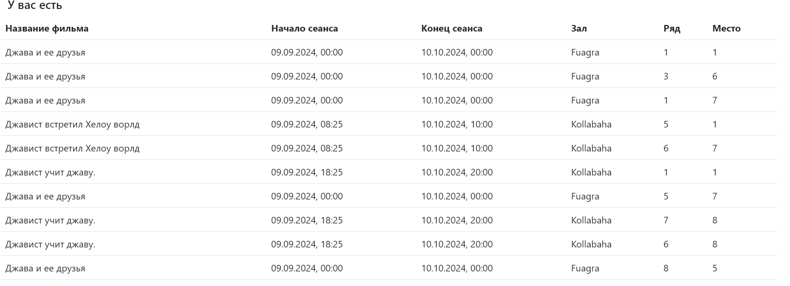

# job4j_cinema

Тестовый проект "Кинотеатр".

Проверка понимания WEB-структур, Thymeleaf. 

Создание веб-приложения на основе базы данных, Thymeleaf, Spring и аннотаций.

### Стек технологий:

_JAVA 17_

_PostgreSQL 42.2.2_

_Maven 4.0_

_Liquibase 4.15.0_

_CheckStyle 3.1.2_

_Mockito_

_Spring Boot_

_Sql2o 1.6.0_

_css_

_js_


### Список ПО 


_JAVA 17_

_PostgreSQL 16_

_Maven 4.0_

_Плагин Liquibase_

_Плагин CheckStyle_

_css_

_js_

### Порядок запуска приложения

1. ``` shell
   create database cinema;
   ```


2. ``` shell 
   liquibase:update
    ```

3. ```shell
    Main.java
    ```
 
http://localhost:8080

### Скриншоты страниц

__Главная страница__



__Страница кинотеки__



__Страница расписания сеансов__


__Страница регистрации пользователя__


__Страница входа в аккаунт__


__Страница выбора мест для покупки билетов__


__Страница удачной покупки билета__


__Страница авторизированного пользователя со всеми купленными билетами__


__Страница ошибки регистрации пользователя__


__Страница ошибки покупки билета__
